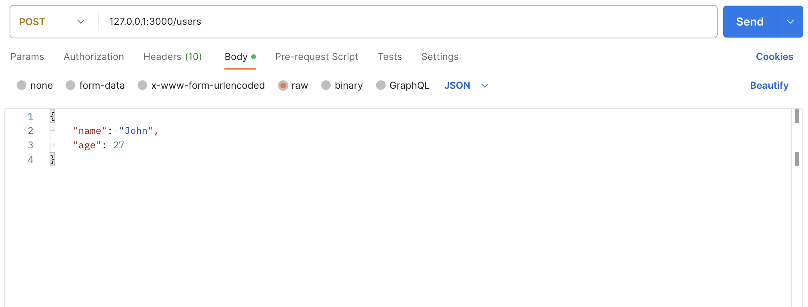
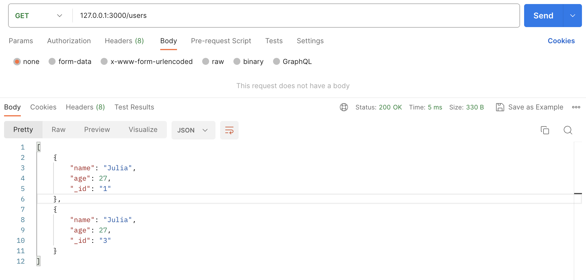
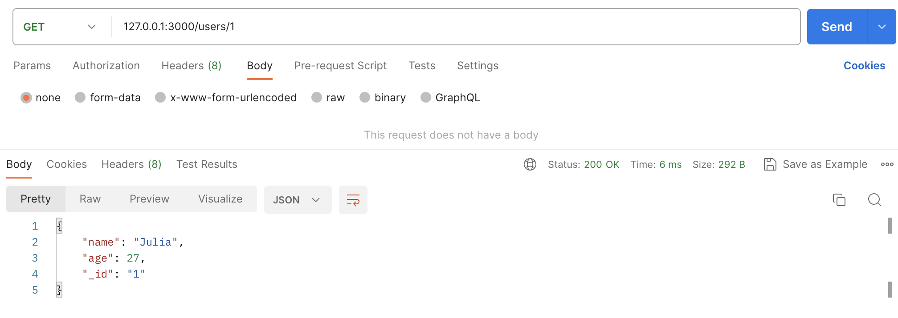
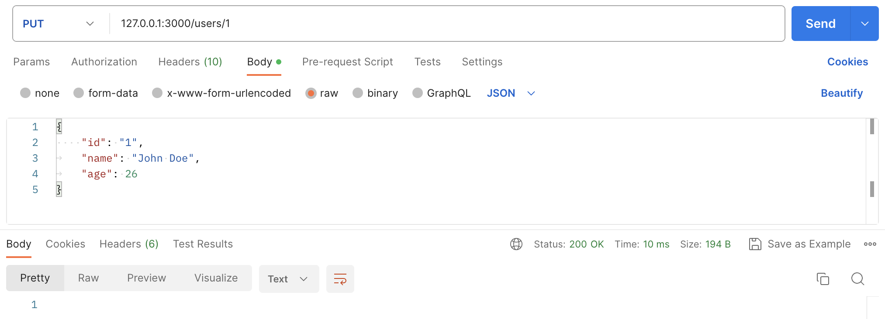
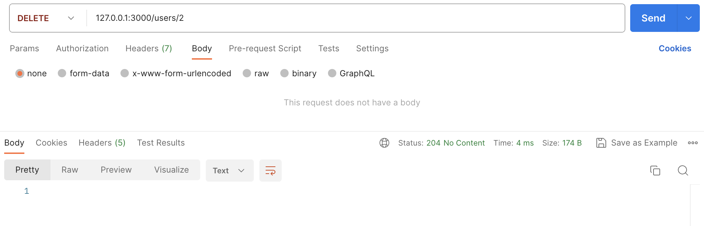

# NodeJS-Restify-API
Create API using Restify in Node.js

### HOW TO RUN:
```console
npm install
node index.js
```
- **getUser** -> <ins>GET</ins>: 127.0.0.1:3000/users/:id
- **getUsers** -> <ins>GET</ins>: 127.0.0.1:3000/users
- **createUser** -> <ins>POST</ins>: 127.0.0.1:3000/users {"name": "John", "age": 25}
- **updateUser** -> <ins>POST</ins>: 127.0.0.1:3000/users/:id {"name": "John Doe", "age": 26}
- **deleteUser** -> <ins>DELETE</ins>: 127.0.0.1:3000/users/:id

### DESCRIPTIONS:
Features:
1. Create n user with **POST method**.
2. Get n user or all users with **GET method**.
3. Delete a user with **DELETE method**.

### SCREENSHOTS:
<kbd></kbd>

<kbd></kbd>

<kbd></kbd>

<kbd></kbd>

<kbd></kbd>
